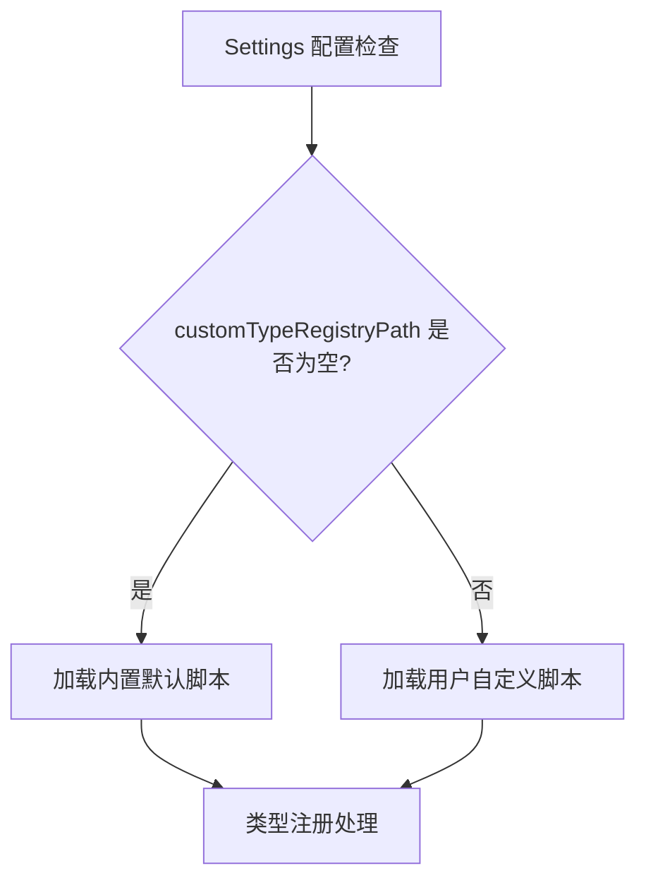

## 产品概述

为 IntelliJ-EmmyLua 插件实现默认类型注册脚本的自动加载功能，当用户未配置自定义类型注册路径时，自动使用内置的默认脚本。同时将示例文件重命名以更准确反映其用途。

## 核心功能

- 当 `customTypeRegistryPath` 配置为空时，自动加载内置的默认类型注册脚本
- 将 `emmyHelper_examples.lua` 文件重命名为 `emmyHelper_ue.lua`
- 保持现有自定义路径配置功能不变，仅在未配置时启用默认行为

## 技术栈

- 开发语言：Kotlin（沿用项目现有技术栈）
- 开发框架：IntelliJ Platform SDK
- 构建工具：Gradle

## 技术架构

### 系统架构

基于现有项目架构，主要涉及设置管理和类型注册模块的修改。



### 模块划分

- **设置模块**：检测 `customTypeRegistryPath` 配置状态
- **类型注册模块**：根据配置状态选择加载内置或自定义脚本
- **资源模块**：管理内置默认脚本文件

### 数据流

1. 插件启动或配置变更时检查 `customTypeRegistryPath`
2. 若为空，定位并加载内置资源目录下的默认脚本
3. 若有值，按原有逻辑加载用户指定路径的脚本

## 实现细节

### 核心目录结构

```
project-root/
├── src/main/
│   ├── kotlin/
│   │   └── [相关设置/类型注册处理类]  # 修改：添加默认路径回退逻辑
│   └── resources/
│       └── emmyHelper_ue.lua          # 重命名：原 emmyHelper_examples.lua
```

### 关键代码结构

**配置检查逻辑**：在获取类型注册路径时添加空值判断，返回默认内置路径。

```
fun getTypeRegistryPath(): String {
    val customPath = settings.customTypeRegistryPath
    return if (customPath.isNullOrBlank()) {
        getBuiltinDefaultScriptPath()
    } else {
        customPath
    }
}
```

### 技术实现方案

1. **问题**：需要在配置为空时提供默认脚本
2. **方案**：在类型注册路径获取逻辑中添加空值检查，回退到内置资源
3. **关键技术**：使用 IntelliJ Platform 的资源加载 API 获取内置脚本
4. **实现步骤**：

- 定位现有类型注册路径获取代码
- 添加空值检查和默认路径回退
- 确保内置脚本可被正确加载

5. **测试策略**：验证空配置和有配置两种场景的行为

## Agent Extensions

### SubAgent

- **code-explorer**
- 用途：探索项目代码库，定位 `customTypeRegistryPath` 的定义位置、使用位置，以及 `emmyHelper_examples.lua` 文件的位置
- 预期结果：找到需要修改的具体文件和代码位置，理解现有类型注册加载逻辑