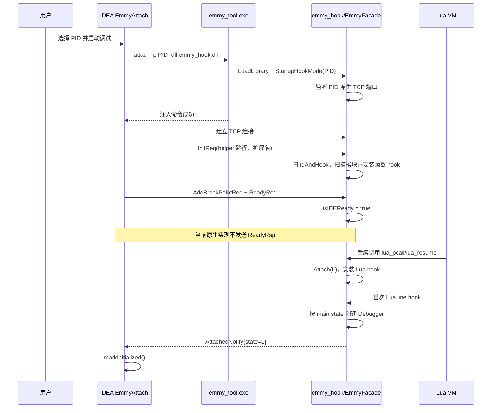
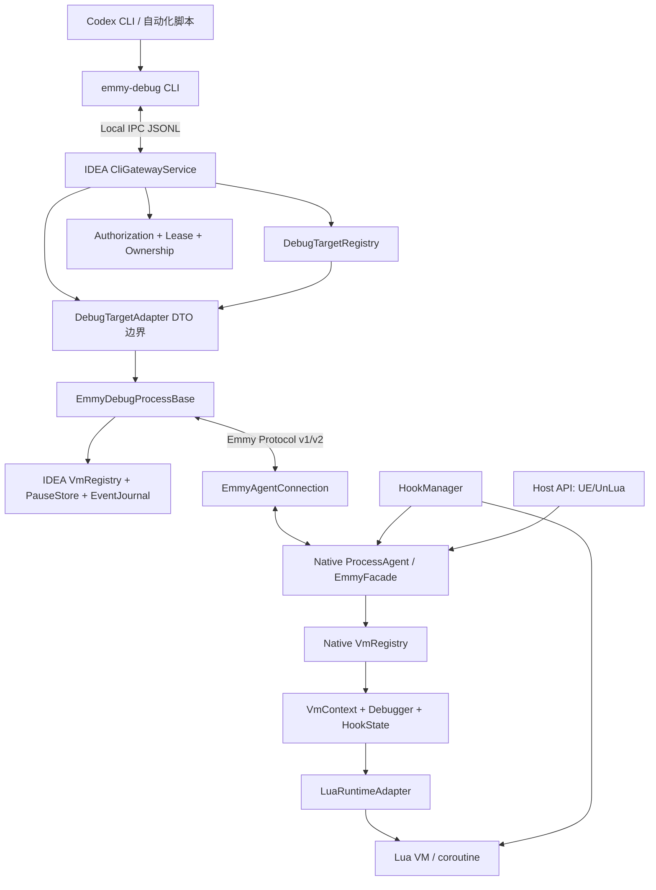
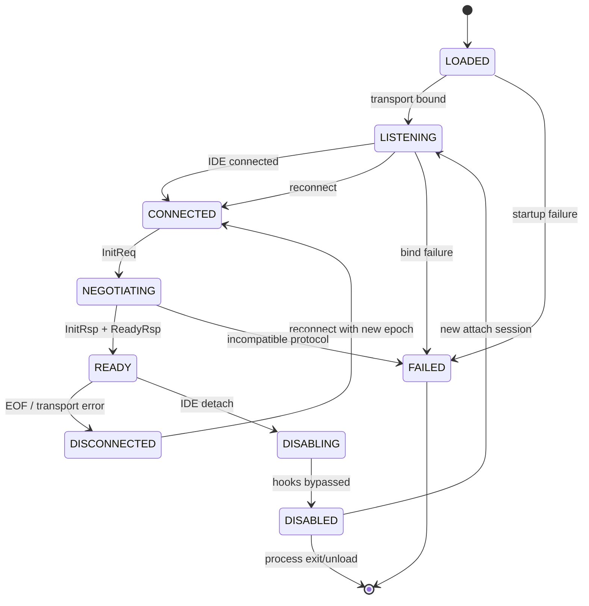
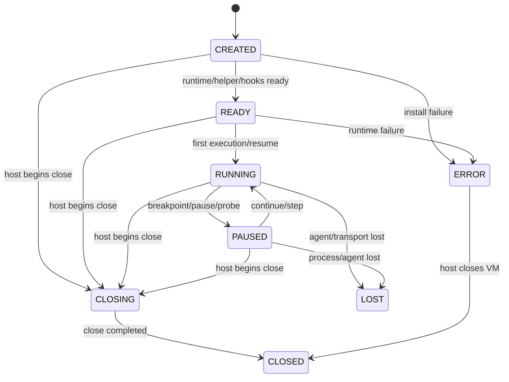
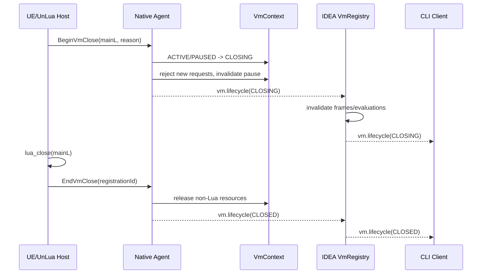

# Emmy Attach、Lua VM 生命周期与 CLI-AI 调试架构设计

> 日期：2026-09-09  
> 状态：已评审并实施主要链路；本地自动化与外部验收边界见 [验证矩阵](2026-09-09-emmy-validation-matrix.md)（更新于 2026-09-10）
> 主仓库基线：`2836e397`  
> `EmmyLuaDebugger` 子模块基线：`ee54dca`  
> 适用范围：IntelliJ-EmmyLua IDEA 插件、`EmmyLuaDebugger` 原生子模块，以及 UE/UnLua 等宿主的接入层

## 1. 摘要

设计基线中的 Emmy Attach 已经具备注入、传输连接、断点、暂停、单步、调用栈和表达式求值等基本能力，但当时的核心抽象仍然是“一个连接对应一个可调试 Lua 状态”。下文保留问题分析和目标设计；当前实现和验证进度以验证矩阵为准。这次改造面向以下目标：

1. 正确感知目标进程中零个、一个或多个独立 Lua VM 的创建、就绪、运行、暂停、关闭和异常丢失。
2. 在同一进程存在多个 Lua VM 时，把断点命中、单步、求值和变量引用路由到确定的 VM 与暂停帧。
3. 在 UE PIE 重启、Lua Env 重建、IDE 重连和目标进程退出时，可靠地清理旧引用并避免访问失效的 `lua_State*`。
4. 让 Codex CLI 等外部 AI 工具通过普通 CLI 调用 IDEA 中已有的调试会话，在指定代码位置采集受限变量和表达式结果。

本设计的核心结论如下：

- **确实缺少 Lua VM 生命周期接口。** `AttachedNotify(state)` 只能说明某次 hook 观察到了一个状态，不能表达 VM 完整生命周期，也不能作为稳定 VM 身份。
- **VM 生命周期不能只靠动态 hook 推断。** UE/UnLua 等可修改宿主应通过显式 Host API 上报；`lua_newstate`、`lua_close`、`pcall`、`resume` hook 仅作为兼容兜底。
- **连接状态与 VM 状态必须分离。** Agent 已连接并不代表已有 VM；VM 关闭也不应必然终止进程级 IDEA 调试会话。
- **多 VM 必须成为一等模型。** 所有 VM 相关的控制、暂停、栈和求值消息必须携带 `vmId`，所有暂停引用必须携带 `pauseId`。
- **AI 接入不采用 MCP。** 新增独立的 `emmy-debug` CLI，通过本机 IPC 连接 IDEA 插件中的 CLI Gateway；协议为版本化 JSONL，请求、响应和事件均为普通 DTO。
- **AI Probe 是首要闭环。** CLI 可以在指定文件与行安装临时条件断点，在命中帧中读取限定表达式，返回有界 JSON 快照，并按策略自动继续。
- **采用渐进兼容迁移。** 现有 0-17 的 Emmy wire id 保持不变，新协议通过追加的 v2 Envelope 扩展；旧 Agent 保留单 VM 兼容模式。

## 2. 范围与非目标

### 2.1 本设计覆盖

- Windows Emmy Attach 的注入、连接、初始化、VM 发现和停止语义。
- `EmmyCore` 主动监听/连接模式与 Attach 模式共享的 VM 生命周期模型。
- 同一进程内多个相互独立的 Lua VM，以及每个 VM 内的 coroutine/thread。
- IDEA 侧进程级调试会话、VM Registry、暂停快照和 VM 选择。
- 原生侧 Process Agent、Runtime Registry、`VmContext`、Debugger 和 Hook Manager。
- UE/UnLua 等宿主可调用的显式 VM 注册与注销接口。
- 外部 `emmy-debug` CLI、IDEA CLI Gateway、授权、控制租约和 AI Probe。
- 协议兼容、错误模型、迁移顺序和测试验收。

### 2.2 本设计不覆盖

- 不在首版由 CLI 启动、附加或终止系统进程；CLI 只操作 IDEA 中已经存在的调试会话。
- 不使用 MCP、HTTP Tool Schema 或 MCP Server。
- 不在首版重写 LuaPandaDebugger；只保留未来适配接口。
- 不承诺从任意静态链接、裁剪导出符号或私有修改过的 Lua 运行时中自动发现完整生命周期。
- 不允许 AI 默认执行任意 Lua 代码、函数调用、元方法或无界对象遍历。
- 不在首版实现多 IDE 客户端同时控制同一个原生 Agent。
- 不把原始 `lua_State*` 暴露为公共、持久或可复用的 API 身份。

## 3. 当前实现梳理

### 3.1 当前组件

| 层 | 当前组件 | 当前职责 |
| --- | --- | --- |
| IDEA 启动层 | `EmmyAttachDebugRunner` | 选择 PID、创建 XDebugger 会话、记录本地附加状态 |
| IDEA 目标准备层 | `EmmyAttachTargetBootstrap` | 选择架构、调用 `emmy_tool attach`、连接 PID 派生端口 |
| IDEA 会话层 | `EmmyDebugProcessBase` | 生命周期状态机、断点同步、控制命令、暂停栈、求值 |
| IDEA Attach 特化 | `EmmyAttachDebugProcess` | 处理 `AttachedNotify` 并把会话标记为 initialized |
| IDEA 传输层 | `Transporter` | TCP/pipe 收发，两个文本行组成一条消息 |
| 注入工具 | `emmy_tool` | 将 `emmy_hook.dll` 注入指定 Windows 进程 |
| 目标进程 Agent | `EmmyFacade` | 进程级单例，持有一个 Transporter 和一个 Debugger Manager |
| Hook 层 | `emmy_hook` | 扫描模块导出，hook `lua_pcall*`、`lua_resume` 和 `LoadLibraryExW` |
| VM/Debugger 层 | `EmmyDebuggerManager`、`Debugger` | 按主 Lua state 保存 Debugger，处理断点、暂停、步进和求值 |
| Lua API 层 | `lua_api_loader`、`lua_state_*` | 动态解析 Lua ABI、定位 main state、遍历 coroutine |

关键源码入口：

- IDEA 附加与连接：[EmmyAttachTargetBootstrap.kt](../../../src/main/java/com/tang/intellij/lua/debugger/emmy/attach/EmmyAttachTargetBootstrap.kt#L16)
- IDEA 握手与消息处理：[EmmyDebugProcessBase.kt](../../../src/main/java/com/tang/intellij/lua/debugger/emmy/EmmyDebugProcessBase.kt#L121)
- IDEA 对 `AttachedNotify` 的处理：[EmmyAttachDebugProcess.kt](../../../src/main/java/com/tang/intellij/lua/debugger/emmy/attach/EmmyAttachDebugProcess.kt#L26)
- 原生 Facade：[emmy_facade.cpp](../../../EmmyLuaDebugger/emmy_debugger/src/emmy_facade.cpp#L209)
- Windows hook：[emmy_hook.windows.cpp](../../../EmmyLuaDebugger/emmy_hook/src/emmy_hook.windows.cpp#L72)
- 原生 Manager：[emmy_debugger_manager.h](../../../EmmyLuaDebugger/emmy_debugger/include/emmy_debugger/debugger/emmy_debugger_manager.h#L23)
- 当前 Kotlin 协议：[EmmyProtocol.kt](../../../modules/debugger-emmy-protocol/src/main/kotlin/com/tang/intellij/lua/debugger/emmy/EmmyProtocol.kt#L24)

### 3.2 当前 Attach 时序



该时序有两个本质特征：

1. 注入和 TCP 连接成功，只能证明 Agent 存在；不能证明 Lua VM 已存在或已安装调试器。
2. VM 发现依赖未来发生的 `pcall`/`resume` 和 line hook。已有但暂时空闲的 VM、导出符号不可见的 VM，以及关闭中的 VM，都无法形成可靠状态。

### 3.3 当前 IDEA 会话状态

当前 `DebugSessionStateMachine` 只有以下主链路：

```text
CREATED -> PREPARING -> CONNECTING -> INITIALIZING -> RUNNING
                                              \-> FAILED
任意非终态 -> STOPPING -> TERMINATED
```

这个状态机适合描述 IDEA 与某个调试后端的连接生命周期，但 `RUNNING` 实际混合了三个不同含义：

- 传输连接已建立；
- Agent 握手完成；
- 至少一个 Lua VM 已可调试。

Attach 目前用第一次 `AttachedNotify` 完成 `INITIALIZING -> RUNNING`，而通用 Emmy 模式等待 `ReadyRsp`。这两个模式对“initialized”的定义不一致。

## 4. 现状问题与风险分级

### 4.1 P0：必须先解决的正确性问题

#### F-01：缺少完整 VM 生命周期协议

证据：

- 当前 hook 表只 hook `lua_pcall`、`lua_pcallk` 和 `lua_resume`，没有 hook `lua_newstate`、`luaL_newstate` 或 `lua_close`：[emmy_hook.windows.cpp](../../../EmmyLuaDebugger/emmy_hook/src/emmy_hook.windows.cpp#L142)。
- `Hook()` 首次遇到未知 main state 时只发送 `AttachedNotify{state}`：[emmy_facade.cpp](../../../EmmyLuaDebugger/emmy_debugger/src/emmy_facade.cpp#L329)。
- `OnLuaStateGC()` 会移除 Debugger，但不发送任何关闭事件：[emmy_facade.cpp](../../../EmmyLuaDebugger/emmy_debugger/src/emmy_facade.cpp#L315)。
- `Debugger::Detach()` 当前为空：[emmy_debugger.cpp](../../../EmmyLuaDebugger/emmy_debugger/src/debugger/emmy_debugger.cpp#L138)。

影响：

- IDEA 不知道 VM 是尚未创建、未被 hook、已经关闭，还是 Agent 失联。
- UE PIE 重启后，旧 `lua_State*` 可能仍出现在日志、变量引用或 AI 请求中。
- 多 VM 场景无法可靠维护列表，CLI 也无法选择正确目标。

设计决定：引入显式 `VmLifecycle`，至少包含 `CREATED`、`READY`、`RUNNING`、`PAUSED`、`CLOSING`、`CLOSED`、`LOST`、`ERROR`。宿主通知为权威，hook 推断为兜底。

#### F-02：协议无法路由多 VM 控制

证据：

- `ActionParams` 只有 `action`，`EvalContext` 只有栈层级和表达式，没有 VM 身份：[proto.h](../../../EmmyLuaDebugger/emmy_debugger/include/emmy_debugger/proto/proto.h#L99)。
- Kotlin `BreakNotify` 只有 `stacks`，`EvalReq` 没有 `vmId` 或 `pauseId`：[EmmyProtocol.kt](../../../modules/debugger-emmy-protocol/src/main/kotlin/com/tang/intellij/lua/debugger/emmy/EmmyProtocol.kt#L149)。
- `EmmyDebuggerManager` 使用进程级单个 `hitDebugger`，`DoAction()` 和 `Eval()` 都隐式作用于最后命中的 Debugger：[emmy_debugger_manager.h](../../../EmmyLuaDebugger/emmy_debugger/include/emmy_debugger/debugger/emmy_debugger_manager.h#L45)。
- `HookStateStepOver` 等可变状态对象由 Manager 中所有 Debugger 共享：[emmy_debugger_manager.h](../../../EmmyLuaDebugger/emmy_debugger/include/emmy_debugger/debugger/emmy_debugger_manager.h#L79)。
- `Debugger::GetStacks()` 在完成栈读取后仍返回 `false`，返回值无法表达“读取成功”：[emmy_debugger.cpp](../../../EmmyLuaDebugger/emmy_debugger/src/debugger/emmy_debugger.cpp#L219)。

影响：

- 两个 VM 并发命中时，后一个可覆盖前一个控制目标。
- 单步状态中的 `currentStateL`、文件、行号和栈深可能跨 VM 污染。
- AI 请求即使指定了代码位置，也无法证明返回值来自预期 VM。

设计决定：每个 `VmContext` 独占 Debugger、HookState 和暂停上下文；所有 VM 级请求必须显式携带 `vmId`。

#### F-03：握手契约不闭合

证据：

- IDEA 在连接后发送 `InitReq`、断点和 `ReadyReq`：[EmmyDebugProcessBase.kt](../../../src/main/java/com/tang/intellij/lua/debugger/emmy/EmmyDebugProcessBase.kt#L121)。
- IDEA 通用 Emmy 会话只在收到 `ReadyRsp` 时调用 `markInitialized()`：[EmmyDebugProcessBase.kt](../../../src/main/java/com/tang/intellij/lua/debugger/emmy/EmmyDebugProcessBase.kt#L246)。
- 原生 `ReadyReq()` 只修改布尔值并唤醒等待线程，没有发送 `ReadyRsp`：[emmy_facade.cpp](../../../EmmyLuaDebugger/emmy_debugger/src/emmy_facade.cpp#L263)。
- 当前子模块源码中没有 `InitRsp`、`ReadyRsp`、`ActionRsp` 或断点响应的发送点。

影响：通用 Emmy 会话可能永久停留在 `INITIALIZING`；Attach 又把首个 VM 发现错误地当作 Agent 握手成功。

设计决定：`InitRsp` 负责版本与能力协商，`ReadyRsp` 负责确认 Agent 可接受命令。Agent Ready 与 VM Ready 分离。

#### F-04：会话停止后 hook 仍可能访问无效 Agent 状态

证据：

- IDEA 停止 Attach 时只关闭传输，本地明确记录“注入 DLL 由目标进程持有到进程退出”：[EmmyAttachTargetBootstrap.kt](../../../src/main/java/com/tang/intellij/lua/debugger/emmy/attach/EmmyAttachTargetBootstrap.kt#L51)。
- 原生 `Debugger::Stop()` 明确不取消 Lua hook：[emmy_debugger.cpp](../../../EmmyLuaDebugger/emmy_debugger/src/debugger/emmy_debugger.cpp#L186)。
- EasyHook handle 创建后没有被集中持有，现有 `UnHook()` 没有参与停止流程：[emmy_hook.windows.cpp](../../../EmmyLuaDebugger/emmy_hook/src/emmy_hook.windows.cpp#L128)。
- `EmmyFacade::Destroy()` 会将 `transporter` 置空，但后续 hook 入口的 `Attach()` 会无空指针保护地访问 `transporter->IsConnected()`：[emmy_facade.cpp](../../../EmmyLuaDebugger/emmy_debugger/src/emmy_facade.cpp#L224)、[emmy_facade.cpp](../../../EmmyLuaDebugger/emmy_debugger/src/emmy_facade.cpp#L402)。

影响：IDE 断开、VM 继续执行后可能触发空指针访问；重复附加和重连也缺少明确代次。

设计决定：Hook Manager 必须保留 hook 句柄并支持幂等 disable/unhook；所有 hook 入口先读取原子 Agent 状态，绝不直接解引用可为空的 Transporter。

### 4.2 P1：生命周期与协议可靠性问题

#### F-05：身份不稳定

- `AttachedNotify.state` 是内存地址，地址可复用，也会泄露实现细节。
- PID 派生端口可能冲突；PID 本身也会复用。
- 当前缺少进程启动时间、Agent Session ID、连接代次和事件序号。

设计决定：引入 `ProcessIdentity`、`agentSessionId`、`connectionEpoch`、`vmId`、`vmGeneration` 和 `eventSeq`。指针只允许作为诊断字段。

#### F-06：全局 Lua ABI 与多运行时声明不一致

当前 `lua_api_loader` 缓存一个 Lua Module、一个全局 `luaVersion` 和一组全局函数指针。它可以支持同一 ABI 下的多个 VM，但不能安全支持同一进程中的多个不同 Lua ABI。

设计决定：首版明确支持“同一 Agent 内多个 VM 使用同一 Lua ABI”；探测到第二种 ABI 时上报 `UNSUPPORTED_MIXED_LUA_ABI`。后续若确有需求，再把 API Table 下沉到 `RuntimeContext`。

#### F-07：协议枚举和消息框架脆弱

- C++ `MessageCMD` 依赖枚举声明顺序，Kotlin 使用显式 wire id。
- 现有传输以“命令行 + 单行 JSON”分帧，没有长度上限、schema 版本和统一错误响应。
- 已声明的响应类型多数未实现。

设计决定：冻结 0-17 的旧 wire id；C++ 同样改为显式值；新增唯一的 `EnvelopeV2(18)`，后续 v2 消息类型使用字符串，不再依赖枚举插入顺序。

#### F-08：进程附加记录只反映 IDEA 本地会话

`ProcessAttachmentManager` 只按 PID 记录 XDebugger Session。它不知道目标是否真的存在可调试 VM，也不能区分 PID 复用、Agent 重启或 VM 全部关闭。

设计决定：本地记录只用于防止重复 UI 操作；真实状态来自 Agent 握手和 VM Snapshot。

### 4.3 P2：AI 调试能力缺失

当前不存在可供外部 CLI 使用的稳定接口，也没有：

- Debug Target Registry；
- VM 选择与状态查询；
- 外部调用授权和控制租约；
- AI 断点所有权；
- 暂停代次与失效引用；
- 有界变量快照；
- 安全求值策略；
- 可等待的调试事件流。

直接把 `EmmyDebugProcessBase` 或 IntelliJ `XStackFrame` 暴露给 CLI 会把 IDE API、线程模型和生命周期泄露到外部协议，因此不可取。

## 5. 设计目标与原则

### 5.1 设计目标

1. VM 创建与关闭都能可靠到达 IDEA；进程中没有 VM 也是合法状态。
2. 多 VM 下每一条控制命令和每一个暂停结果都能无歧义路由。
3. 重连、PIE 重启、指针复用和迟到响应不会复活旧状态。
4. 原生代码只在 Lua 所属线程访问 Lua API。
5. IDEA、CLI 和未来其他调用方只使用稳定 DTO，不依赖 XDebugger 实现对象。
6. AI 可以完成“指定位置 -> 条件命中 -> 采集变量 -> 返回 JSON -> 可选继续”的闭环。
7. 外部控制默认关闭，授权、所有权、租约和审计相互独立。
8. 老版本 IDEA/Agent 可以进入明确的单 VM兼容模式，不因新增协议直接失效。

### 5.2 设计原则

- **身份先于功能。** 没有稳定 `vmId` 和 `pauseId`，不开放求值与 AI Probe。
- **快照先于事件。** IDEA 收到暂停事件前，相关暂停快照必须已经可查询。
- **显式优于推断。** Host API 是 VM 生命周期权威来源；hook 只补足不可改宿主。
- **状态正交。** 传输、Agent、VM 执行、授权和控制租约分别建模。
- **Lua 线程封闭。** 传输线程只解析和排队，不直接访问 Lua 栈。
- **有界默认。** 变量深度、节点数、字节数、等待时间和事件日志全部有上限。
- **兼容追加。** 不修改旧 wire id 的含义，不在旧枚举中间插入新值。
- **失败显式。** 所有请求必须成功或返回结构化错误，不能静默丢弃。

## 6. 领域模型与身份

### 6.1 核心术语

| 术语 | 定义 | 生命周期 |
| --- | --- | --- |
| IDEA Instance | 一个运行中的 JetBrains IDE 进程 | IDEA 进程 |
| Debug Target | IDEA 中一个可由外部工具寻址的调试会话 | XDebugger Session |
| Process Agent | 注入或由 `emmy_core` 加载到目标进程的原生 Agent | 目标进程或显式卸载 |
| Lua VM | 共享一个 `global_State` 的独立 Lua 运行时实例 | 主 state 创建到关闭 |
| Lua Thread | VM 内 main thread 或 coroutine | coroutine 创建到回收 |
| Pause | 某个 VM 的一次暂停代次 | 命中到继续/关闭 |
| Frame | 某次 Pause 中的调用栈帧 | 依附 Pause |
| Probe | AI 拥有的条件位置采集任务 | 安装到命中/取消/超时 |
| Lease | 外部客户端对一个 Debug Target 的独占控制权 | TTL、释放或连接结束 |

### 6.2 身份字段

| 字段 | 生成方 | 规则 |
| --- | --- | --- |
| `ideaInstanceId` | IDEA Gateway | 每次 IDEA 进程启动生成随机 ID |
| `targetId` | IDEA Target Registry | 每个 XDebugger Session 唯一，不能由显示名称推导 |
| `processIdentity` | Native + IDEA | PID、进程启动时间和随机 nonce 的组合 |
| `agentSessionId` | Native Agent | Agent 每次初始化生成；重启或重新注入必须变化 |
| `connectionEpoch` | 连接双方 | 每次传输连接递增 |
| `vmId` | Native VM Registry | 每个 VM 生命周期随机或单调生成的 opaque ID |
| `vmGeneration` | Native VM Registry | 同一诊断地址再次注册时递增，防止指针复用 |
| `threadId` | Native `VmContext` | 在 `vmId` 内唯一，不把裸 coroutine 指针作为公共 ID |
| `pauseId` | Native/IDEA | 每次暂停递增；继续、VM 关闭或失联后立即失效 |
| `frameId` | IDEA Pause Store | `targetId + vmId + pauseId + frameIndex` 的 opaque 编码 |
| `requestId` | 请求发起方 | 每个连接内唯一，用于请求响应关联 |
| `eventSeq` | Agent 或 IDEA Event Journal | 单调递增，用于重放、等待和丢失检测 |

### 6.3 Lua VM 与 coroutine 的边界

- 非 LuaJIT 环境可通过 `GetMainState(L)` 将 coroutine 归并到同一个 VM。
- `lua_newthread` 只创建 Lua Thread，不创建新 VM。
- `lua_newstate`/`luaL_newstate` 才创建独立 VM。
- LuaJIT 当前缺少可靠的通用 main-state 推导；多 LuaJIT VM 必须优先依赖 Host API 提供稳定宿主标识。
- `AttachedNotify.state` 中的地址只保留为 `diagnosticStateAddress`，不再参与公共身份或命令路由。

## 7. 目标架构



### 7.1 IDEA 侧组件

#### `DebugTargetRegistry`

- Application 级服务，聚合所有 Project 中受支持的调试会话。
- 注册 `targetId`、项目、配置类型、进程身份、连接状态和能力。
- 只暴露 DTO；不向 CLI 暴露 `XDebugSession`、`XStackFrame` 或 Swing 对象。
- 会话终止时先发布 `target.removed`，再删除内部引用。

#### `DebugTargetAdapter`

- 统一 CLI 与具体 Debug Backend 的边界。
- 首版实现 `EmmyDebugTargetAdapter`。
- 负责把外部请求串行化到现有 debugger lifecycle executor。
- 后续 LuaPanda 可实现同一接口，但不属于首版验收。

建议接口能力：

```kotlin
interface DebugTargetAdapter {
    fun describe(): DebugTargetDto
    fun listVms(): List<VmDto>
    fun currentPause(vmId: String): PauseDto?
    fun setBreakpoints(request: BreakpointMutation): BreakpointResult
    fun control(request: DebugControlRequest): DebugControlResult
    fun evaluate(request: EvaluationRequest): EvaluationResult
    fun installProbe(request: ProbeInstallRequest): ProbeDto
    fun removeProbe(probeId: String): Boolean
    fun readEvents(after: Long, limit: Int): EventPage
}
```

该接口是设计契约，类名和签名可在实施计划中按项目风格调整。

#### `VmRegistry`

- 每个 Debug Target 独立持有。
- 保存 `vmId -> VmRecord`、当前选中 VM、状态、能力和最后事件序号。
- `VmSnapshot` 是权威重建入口，生命周期 Event 是增量更新入口。
- VM 关闭时立即失效该 VM 的 Pause、Frame、Variable Reference 和待处理求值。

#### `PauseSnapshotStore`

- key 为 `targetId + vmId + pauseId`。
- 先写入完整的有界顶层快照，再发布 `debug.paused` 事件。
- 继续、单步、VM 关闭或连接代次变化时失效。
- 旧 `frameId` 返回 `STALE_PAUSE_REFERENCE`，不能自动映射到新暂停。

#### `CliGatewayService`

- IDEA 进程级本地服务，不是 MCP Server。
- 只监听当前用户可访问的命名管道/Unix Domain Socket；TCP 仅作为显式 fallback。
- 负责实例发现、认证、请求限流、DTO 编解码和事件等待。
- 不直接操作 XDebugger；所有请求经 `DebugTargetRegistry -> DebugTargetAdapter`。

### 7.2 原生侧组件

#### `ProcessAgent`

保留 `EmmyFacade` 作为对外 Facade，但将以下状态拆到独立组件：

- `AgentLifecycle`：注入、监听、连接、握手、禁用、关闭。
- `ProtocolSession`：版本协商、请求关联、event sequence、错误响应。
- `NativeVmRegistry`：VM 身份、状态和 snapshot。
- `HookManager`：EasyHook 句柄、模块扫描、enable/disable/unhook。
- `HostIntegration`：宿主显式生命周期入口。
- `EventSink`：将线程内事件排入有界发送队列。

#### `VmContext`

每个 VM 独占以下成员：

- `vmId`、`vmGeneration`、main state、宿主名称和 runtime descriptor；
- 一个 `Debugger`；
- 一组该 VM 自有的 HookState；
- coroutine/thread registry；
- 当前执行状态和 `pauseId`；
- Lua 线程任务队列；
- helper 安装状态；
- 关闭屏障和待处理请求集合。

不得再由 Manager 共享有可变字段的 `HookStateStepOver/StepIn/StepOut`。

#### `LuaRuntimeAdapter`

- 封装 Lua 5.1/5.2/5.3/5.4/LuaJIT 的 ABI 差异。
- 提供 main state、raw value 读取、栈读取、hook 设置和受限求值能力。
- 首版一个 Process Agent 只允许一个 ABI descriptor；不同 ABI 明确拒绝，而不是复用错误函数指针。

#### `HookManager`

- 保存每个模块、符号、原函数和 Hook Handle。
- 相同符号安装幂等；重复扫描不会重复 hook。
- 支持 `DISABLED`：hook 仍存在但快速转发原函数，不访问 Agent/VM。
- 支持安全条件下的 `UNHOOKED`；若不能安全卸载，明确上报 `supportsUnhook=false`。
- hook 回调只读取原子状态和提交轻量事件，不进行网络等待或复杂模块扫描。

### 7.3 IDEA 会话粒度

首版采用**一个目标进程对应一个 IDEA XDebugger Session，Session 内包含多个 VM**，原因是：

- 注入和传输连接是进程级资源；
- 断点通常需要对进程内所有 VM 同步；
- 为每个 VM 创建独立 XDebugger Session 会造成重复注入、重复连接和复杂 UI 生命周期；
- CLI 可以通过 `targetId + vmId` 精确寻址，不需要额外 XDebugger Session。

IDEA 增加 VM 列表/选择器。用户执行暂停、单步、求值时必须有确定 VM；只有一个可用 VM 时可以自动选择。

## 8. 生命周期模型

### 8.1 Agent/连接状态



规则：

- `READY` 只表示 Agent 握手完成，不要求当前存在 VM。
- 每次 `CONNECTED` 产生新的 `connectionEpoch`。
- 重连后 IDEA 必须先取 `VmSnapshot`，再消费后续增量事件。
- 连接断开不伪造 `CLOSED`；所有仍活跃 VM 在 IDEA 侧变为 `LOST`，直到 snapshot 重新确认。

### 8.2 VM 状态



状态语义：

| 状态 | 可接受操作 |
| --- | --- |
| `CREATED` | 查询描述；不能暂停、求值或安装 Lua hook 依赖功能 |
| `READY` | 同步断点、查询能力；尚未观测到执行 |
| `RUNNING` | pause、安装/删除断点和 Probe |
| `PAUSED` | 栈、作用域、变量、受限求值、continue/step |
| `CLOSING` | 只允许查询最终状态；所有新控制请求拒绝 |
| `CLOSED` | 终态，只保留有界诊断记录 |
| `LOST` | IDEA 观察终态；若重连 snapshot 发现同 `vmId`，可恢复为实际状态 |
| `ERROR` | 只允许诊断与关闭，不允许继续调试 |

### 8.3 暂停状态

每次暂停创建新 `pauseId`：

1. Native 在 Lua owner thread 固定当前 VM、thread 和 stack。
2. Native 递增 `pauseId`，生成 VM-scoped stack snapshot。
3. Native 发送 `debug.paused`。
4. IDEA 写入 `PauseSnapshotStore`。
5. IDEA 发布内部事件，XDebugger UI 和 CLI 才可查询。
6. continue/step/close 先使 `pauseId` 失效，再发送控制命令。

同一 VM 只允许一个活动 Pause。不同 VM 可以分别暂停，但首版外部控制租约仍以整个 Debug Target 为粒度，避免 IDEA UI 与 CLI 对不同 VM 同时发出不一致控制命令。

### 8.4 关闭时序



`BeginVmClose` 必须在 `lua_close` 之前、Lua owner thread 上调用；`EndVmClose` 使用 opaque `registrationId`，不能在 `lua_close` 后再次解引用 state。

## 9. Host API 设计

### 9.1 为什么必须有 Host API

动态 hook 只能观察导出的 API 调用，无法保证：

- Lua 创建/关闭符号可被枚举；
- 宿主使用标准 `luaL_newstate`/`lua_close`；
- VM 创建后一定会再次经过 `pcall`/`resume`；
- 静态链接或定制 Lua 的内部 ABI 与探测器一致；
- 关闭通知能在 state 仍然有效时执行。

UE/UnLua 已经拥有真正的 VM 生命周期所有者，因此应在这个边界显式通知。

### 9.2 建议 C ABI

以下为契约示例，不是本设计阶段的实现代码：

```cpp
#include <stdint.h>

#ifdef __cplusplus
extern "C" {
#endif

typedef struct lua_State lua_State;
typedef uint64_t EmmyVmRegistrationId;

typedef struct EmmyVmMetadata {
    const char* displayName;
    const char* engineName;
    const char* engineContext;
    const char* luaVersionHint;
    const char* runtimeModule;
    unsigned int flags;
} EmmyVmMetadata;

EmmyVmRegistrationId Emmy_RegisterLuaVm(
    lua_State* mainState,
    const EmmyVmMetadata* metadata);

int Emmy_NotifyLuaVmReady(EmmyVmRegistrationId registrationId);

int Emmy_BeginLuaVmClose(
    EmmyVmRegistrationId registrationId,
    const char* reason);

void Emmy_EndLuaVmClose(EmmyVmRegistrationId registrationId);

void Emmy_ReleaseLuaVmRegistration(EmmyVmRegistrationId registrationId);

int Emmy_SetLuaVmDisplayName(
    EmmyVmRegistrationId registrationId,
    const char* displayName);

#ifdef __cplusplus
}
#endif
```

契约要求：

- 注册、Ready 和 BeginClose 在 VM owner thread 调用。
- `RegisterLuaVm` 幂等：同一个活动 main state 重复注册返回同一 registrationId。
- `BeginLuaVmClose` 幂等，第一次调用后立即拒绝新 Lua 操作。
- `EndLuaVmClose` 不访问 `lua_State*`，可以在 `lua_close` 返回后调用。
- `ReleaseLuaVmRegistration` 只释放 Agent 元数据；重复调用必须安全。
- `EmmyVmMetadata` 和 `displayName` 的字符串只在调用期间借用，Agent 必须在返回前复制需要保存的内容。
- Host 提供的 display name 只用于展示；身份由 Agent 生成。
- Agent 未激活时 API 必须是低成本 no-op，不影响 Shipping 或非调试构建。
- Agent 未激活时仍返回非零 pending `registrationId`，Host 可用它继续上报 Ready/Close；只有参数无效或注册失败时才返回 `registrationId=0`。pending registration 不代表 Agent 已 Ready，不能据此执行 Lua 调试操作。

### 9.3 UE/UnLua 接入时序

建议接入点：

1. 创建 `lua_State` 并完成基础库、全局表和 UnLua 绑定初始化。
2. 调用 `Emmy_RegisterLuaVm`。
3. Debugger helper 和 hook 可安全安装后调用 `Emmy_NotifyLuaVmReady`。
4. `FLuaEnv` 或等价生命周期 owner 决定关闭时，先调用 `Emmy_BeginLuaVmClose`。
5. 调用实际 `lua_close`/环境释放。
6. 调用 `Emmy_EndLuaVmClose`。
7. 不再需要该注册记录时调用 `Emmy_ReleaseLuaVmRegistration`。

这条路径同时解决 IDE-first 和 PlayGame-first：VM 可以先于 IDE 创建，Agent 在 IDE 握手后通过 snapshot 上报；IDE 也可以先连接，在后续 VM 注册时收到增量事件。

### 9.4 自动 hook 兜底

对不可修改宿主，Hook Manager 尝试：

| 函数 | 用途 | 可靠性说明 |
| --- | --- | --- |
| `lua_newstate`、`luaL_newstate` | 创建独立 VM | 仅导出符号存在时可用 |
| `lua_close` | 关闭 VM | 必须在原函数调用前发 CLOSING，调用后只使用 registrationId |
| `lua_newthread` | 发现 coroutine | 不是新 VM，只登记 thread |
| `lua_closethread` | coroutine 关闭 | 仅适用支持该 API 的版本 |
| `lua_pcall*`、`lua_resume` | 发现遗漏 VM、驱动 line hook | 保留现有兼容能力 |
| `LoadLibraryExW` | 新模块出现后扫描 Lua 导出 | 不承担 VM 生命周期权威性 |

禁止通过预加载 Bridge 或伪造 `lua_pcall`/`lua_resume` 来制造发现时机。自动发现失败必须形成诊断事件，而不是改变目标程序调用顺序。

当前 registry `__gc` 回调可以保留为最后一道关闭兜底，但只允许提交轻量 `CLOSING/CLOSED` 事件和清理 Agent 元数据，不得在 Lua GC finalizer 内等待网络、卸载 DLL 或执行复杂锁链。

## 10. 原生 Debugger 接口重构

### 10.1 Manager API 必须显式 VM 化

建议由：

```text
DoAction(action)
Eval(context)
GetHitBreakpoint()
```

改为语义明确的：

```text
DoAction(vmId, pauseId?, action)
Evaluate(vmId, pauseId, frameId, expression, policy)
GetVm(vmId)
ListVms()
```

不得继续使用进程级 `hitDebugger` 作为路由依据。

### 10.2 Lua 线程模型

- Transport thread：解析协议、校验身份、将请求放入指定 `VmContext` 队列。
- Lua owner thread：执行 hook、栈读取、变量读取和求值。
- Agent event thread：序列化 DTO、递增 eventSeq、发送网络消息。
- IDEA lifecycle executor：按连接代次处理原生事件。
- EDT：只负责 XDebugger/UI 更新。

跨线程不得直接读取 `currentL`、Lua 栈或 helper table。

### 10.3 Debugger 停止语义

区分三种操作：

| 操作 | 含义 |
| --- | --- |
| `continue` | 继续当前 VM 执行，不影响 Agent |
| `detachSession` | IDEA 断开控制；Agent 禁用调试、保留 DLL，可再次连接 |
| `unhookAgent` | 在能力允许时移除 EasyHook/Lua hook；不默认 FreeLibrary |

首版必须实现可靠的 `detachSession -> DISABLED`。如果 `supportsUnhook=false`，Agent 仍驻留，但所有 hook callback 只能快速调用原函数，不能访问已释放 Transporter。

## 11. Emmy 协议 v2

### 11.1 兼容策略

1. 旧 wire id `0..17` 永久冻结。
2. C++ 和 Kotlin 两端都为旧枚举写出显式整数值。
3. 追加 `EnvelopeV2 = 18`。
4. v2 的具体消息通过 Envelope 内的 `type` 字符串区分。
5. `InitReq` 增加可选 `supportedProtocolVersions` 和 `clientCapabilities`；旧 Agent 会忽略。
6. 新 Agent 必须回复 `InitRsp` 和 `ReadyRsp`。
7. IDEA 在短握手窗口内未收到 `InitRsp` 时进入 `LEGACY_V1`，而不是无限等待。
8. `AttachedNotify` 在过渡期保留；v2 IDEA 将其视为兼容诊断，不再作为唯一 VM 生命周期来源。

### 11.2 Envelope

```json
{
  "cmd": 18,
  "protocolVersion": 2,
  "kind": "request",
  "type": "debug.evaluate",
  "requestId": "req-73f1",
  "agentSessionId": "agent-a2f8",
  "connectionEpoch": 3,
  "target": {
    "vmId": "vm-7a91",
    "threadId": "thread-main",
    "pauseId": 12,
    "frameId": "frame-12-0"
  },
  "payload": {
    "expression": "self.State",
    "policy": "VALUE_PATH",
    "maxDepth": 2
  }
}
```

响应：

```json
{
  "cmd": 18,
  "protocolVersion": 2,
  "kind": "response",
  "type": "debug.evaluate",
  "requestId": "req-73f1",
  "agentSessionId": "agent-a2f8",
  "connectionEpoch": 3,
  "ok": true,
  "payload": {
    "value": {
      "type": "string",
      "display": "Loading",
      "truncated": false
    }
  }
}
```

事件：

```json
{
  "cmd": 18,
  "protocolVersion": 2,
  "kind": "event",
  "type": "vm.lifecycle",
  "eventSeq": 1042,
  "agentSessionId": "agent-a2f8",
  "connectionEpoch": 3,
  "target": {
    "vmId": "vm-7a91"
  },
  "payload": {
    "previous": "RUNNING",
    "current": "CLOSING",
    "reason": "PIE_END"
  }
}
```

### 11.3 v2 消息目录

| `type` | 方向 | 作用 |
| --- | --- | --- |
| `agent.describe` | req/rsp | Agent、协议、进程身份和能力 |
| `vm.snapshot` | req/rsp | 返回所有 VM 及 snapshot 对应的 `eventSeq` |
| `vm.lifecycle` | event | VM 创建、Ready、运行、关闭、丢失和错误 |
| `thread.lifecycle` | event | 可选 coroutine 创建/销毁 |
| `breakpoint.replace` | req/rsp | 按 owner/scope 原子替换断点集合 |
| `breakpoint.remove` | req/rsp | 删除调用者拥有的断点 |
| `debug.pause` | req/rsp | 请求指定 VM 在下一安全点暂停 |
| `debug.action` | req/rsp | continue、stepIn、stepOver、stepOut |
| `debug.paused` | event | 携带 VM、thread、pauseId、原因和有界栈 |
| `debug.resumed` | event | 指定 pauseId 已失效 |
| `debug.evaluate` | req/rsp | 指定暂停帧内的受限求值 |
| `probe.install` | req/rsp | 安装 AI Probe |
| `probe.remove` | req/rsp | 删除调用者拥有的 Probe |
| `probe.hit` | event | Probe 命中及捕获值 |
| `session.detach` | req/rsp | 禁用 Agent 调试并安全断开 |
| `heartbeat` | req/rsp | 连接和 Agent 活性确认 |
| `process.exiting` | event | 可观测到的正常进程退出；异常退出仍以 EOF 表示 |
| `diagnostic` | event | hook、ABI、helper 和限额诊断 |
| `error` | rsp/event | 标准错误对象 |

### 11.4 VM Snapshot 与事件一致性

`vm.snapshot` 响应包含：

```json
{
  "snapshotEventSeq": 1040,
  "vms": [
    {
      "vmId": "vm-7a91",
      "generation": 2,
      "displayName": "UnLua GameInstance",
      "state": "RUNNING",
      "luaVersion": "5.4",
      "discovery": "HOST_API",
      "diagnosticStateAddress": "redacted-diagnostic-address"
    }
  ]
}
```

IDEA 应用 snapshot 后，只接受 `eventSeq > snapshotEventSeq` 的增量事件。重复事件按 `eventSeq` 幂等忽略。发现序号间隙时重新请求 snapshot。

### 11.5 标准错误

```json
{
  "code": "STALE_PAUSE_REFERENCE",
  "message": "pauseId 12 is no longer active",
  "retryable": false,
  "details": {
    "vmId": "vm-7a91",
    "activePauseId": 13
  }
}
```

首版错误码：

- `PROTOCOL_UNSUPPORTED`
- `CAPABILITY_UNSUPPORTED`
- `TARGET_NOT_FOUND`
- `VM_NOT_FOUND`
- `VM_NOT_READY`
- `VM_CLOSING`
- `AMBIGUOUS_VM`
- `STALE_PAUSE_REFERENCE`
- `REQUEST_TIMEOUT`
- `TARGET_BUSY`
- `NOT_AUTHORIZED`
- `EVALUATION_DENIED`
- `EVALUATION_LIMIT_EXCEEDED`
- `TRANSPORT_DISCONNECTED`
- `MIXED_LUA_ABI_UNSUPPORTED`
- `INTERNAL_ERROR`

### 11.6 v1 兼容限制

连接旧 Agent 时：

- IDEA 创建一个 `legacy-<connectionEpoch>-<stateAddress>` VM。
- 只有一个 legacy VM 时，旧 `ActionReq/EvalReq/BreakNotify` 才允许工作。
- 收到第二个不同 `AttachedNotify` 后，外部 CLI 的控制和求值被禁用，返回 `CAPABILITY_UNSUPPORTED`，避免错误路由。
- 旧连接没有可靠 close event；断线后 VM 标记 `LOST`。
- AI Probe 不在 legacy 模式开放。

## 12. IDEA VM 体验

### 12.1 VM 列表

在 Debug Tool Window 增加非装饰性的 `Lua VMs` 视图，展示：

- VM display name；
- `READY/RUNNING/PAUSED/CLOSING/CLOSED/LOST/ERROR`；
- Lua 版本与 discovery source；
- 最后暂停位置；
- 诊断地址，仅在详细信息中显示。

只有一个可用 VM 时自动选择；多个 VM 时，控制动作作用于当前选中 VM。收到非当前 VM 的暂停事件时，将该 VM 标为 Paused，并切换到该暂停上下文；不静默覆盖另一个活动 pause。

### 12.2 VM 关闭行为

- 当前选中 VM 关闭：清除执行点和 Variables，自动选择唯一剩余 VM；否则显示“等待 Lua VM”。
- 非当前 VM 关闭：只更新 VM 列表和相关事件。
- 所有 VM 关闭但进程 Agent 仍在线：XDebugger Session 保持 Ready，不自动停止。
- 目标进程退出或 Agent 无法恢复：终止 Session。

### 12.3 Attach 初始化语义

`EmmyAttachDebugProcess` 不再以第一次 `AttachedNotify` 作为会话初始化条件：

1. TCP connected -> `NEGOTIATING`。
2. `InitRsp + ReadyRsp` -> Agent `READY`。
3. `VmSnapshot` 为空 -> UI 显示等待 VM。
4. VM Ready event -> VM 可调试。

这让“成功注入但尚无 VM”和“VM 已存在但未执行”成为可解释状态，而不是连接超时。

## 13. CLI 架构

### 13.1 连接方式

采用“外部 CLI 连接已运行 IDEA 插件服务”：

```text
Codex CLI
  -> 启动 emmy-debug 子命令
  -> emmy-debug 查找 IDEA Instance Descriptor
  -> 本地 IPC 连接 CliGatewayService
  -> 选择 targetId/vmId
  -> 执行请求并输出 JSON
```

IDEA 不拉起或托管 Codex CLI。CLI 崩溃只影响自己的连接，不能带走调试会话。

### 13.2 本地 IPC

优先级：

1. Windows：命名管道 `\\.\pipe\emmylua-<ideaPid>-<nonce>`，ACL 限制为当前用户。
2. macOS/Linux：Unix Domain Socket，文件权限 `0600`。
3. 显式启用时：`127.0.0.1` 随机端口，必须使用 token。

IDEA 在用户私有目录写实例描述文件：

```json
{
  "schemaVersion": 1,
  "ideaInstanceId": "idea-c20a",
  "pid": 18432,
  "product": "Rider",
  "endpoint": "npipe://emmylua-18432-1f72",
  "startedAt": "2026-09-09T10:30:00+08:00",
  "tokenFile": "%IDEA_SYSTEM%/emmylua-cli/token"
}
```

CLI 可通过 `--instance`、`--endpoint` 或 `EMMY_DEBUG_ENDPOINT` 显式选择。存在多个 IDEA Instance 时不得随机选择。

### 13.3 CLI 协议

- JSON Lines，一行一个完整请求或响应。
- 每条请求有 `requestId`、`operation`、`targetId` 和 `arguments`。
- stdout 只输出结果 JSON；日志和诊断写 stderr。
- 长等待命令通过 Event Journal 实现，不长期占用 IDEA lifecycle executor。
- 协议 DTO 位于独立模块，不能依赖 IntelliJ SDK。

### 13.4 CLI 命令面

| 命令 | 用途 | 是否需要目标授权/租约 |
| --- | --- | --- |
| `emmy-debug instance list` | 列出 IDEA 实例 | 本机 token |
| `emmy-debug target list` | 列出调试会话 | 授权后可见详细信息 |
| `emmy-debug target status` | 获取连接、Agent 和 VM 摘要 | 目标授权 |
| `emmy-debug vm list` | 列出 VM | 目标授权 |
| `emmy-debug wait` | 等待 pause、probe、VM lifecycle | 目标授权 |
| `emmy-debug stack` | 读取当前暂停栈 | 目标授权 |
| `emmy-debug scopes` | 列出 locals/upvalues | 目标授权 |
| `emmy-debug variables` | 有界展开变量 | 目标授权 |
| `emmy-debug eval` | 暂停帧内求值 | 目标授权 + 控制租约 |
| `emmy-debug breakpoint add/remove/list` | 管理 CLI 自有断点 | 目标授权 + 控制租约 |
| `emmy-debug pause/continue/step` | 控制指定 VM | 目标授权 + 控制租约 |
| `emmy-debug probe run` | 一次性位置条件采集 | 目标授权 + 控制租约 |
| `emmy-debug lease acquire/release` | 获取/释放控制权 | 目标授权 |

所有 VM 级命令都接受 `--vm <vmId>`。当 target 中有多个活动 VM 而参数缺失时返回 `AMBIGUOUS_VM`。

### 13.5 CLI 退出码

| 退出码 | 含义 |
| --- | --- |
| `0` | 请求成功 |
| `2` | 参数或命令格式错误 |
| `3` | IDEA 实例发现或认证失败 |
| `4` | Target/VM 状态不满足 |
| `5` | 等待或请求超时 |
| `6` | 求值被拒绝或求值失败 |
| `7` | 传输或内部错误 |
| `8` | 控制租约被其他客户端持有 |

## 14. AI Probe 设计

### 14.1 目标

`probe run` 用一个命令完成：

1. 获取指定 Debug Target 的控制租约。
2. 在指定 `file + line` 安装 CLI 所有的临时条件断点。
3. 等待目标 VM 命中。
4. 在命中 `pauseId + frameId` 中采集表达式。
5. 返回有界、结构化 JSON 给 Codex CLI。
6. 根据策略删除 Probe、继续执行并释放租约。

示例：

```powershell
emmy-debug probe run `
  --target target-41ae `
  --vm vm-7a91 `
  --file Project/Content/Script/Loading.lua `
  --line 128 `
  --condition 'self.State == "Loading"' `
  --capture self.State `
  --capture self.RequestId `
  --capture request.retryCount `
  --hit-count 1 `
  --auto-continue `
  --timeout 60s `
  --json
```

### 14.2 Probe DTO

```json
{
  "probeId": "probe-2f8d",
  "owner": "cli:client-b11c",
  "scope": "SESSION",
  "targetId": "target-41ae",
  "vmId": "vm-7a91",
  "location": {
    "file": "Project/Content/Script/Loading.lua",
    "line": 128
  },
  "condition": "self.State == \"Loading\"",
  "captures": [
    "self.State",
    "self.RequestId",
    "request.retryCount"
  ],
  "evaluationPolicy": "VALUE_PATH",
  "hitLimit": 1,
  "autoContinue": true,
  "timeoutMillis": 60000
}
```

### 14.3 Probe 命中结果

```json
{
  "ok": true,
  "event": "probe.hit",
  "targetId": "target-41ae",
  "vmId": "vm-7a91",
  "probeId": "probe-2f8d",
  "pauseId": 12,
  "threadId": "thread-main",
  "frameId": "frame-12-0",
  "location": {
    "file": "Project/Content/Script/Loading.lua",
    "line": 128
  },
  "values": [
    {
      "expression": "self.State",
      "success": true,
      "type": "string",
      "display": "Loading",
      "truncated": false
    },
    {
      "expression": "self.RequestId",
      "success": true,
      "type": "number",
      "display": "41827",
      "truncated": false
    }
  ],
  "autoContinued": true
}
```

### 14.4 Probe 与普通断点关系

- Probe 有独立 `probeId`、owner 和 hit limit。
- IDEA 中可见，但默认 scope 为 `SESSION`，会话结束自动删除。
- CLI 只能删除自己 owner 下的 Probe/断点。
- 同一位置同时命中用户断点和 Probe 时，事件包含全部 reason；即使 Probe 配置 `autoContinue=true`，也不得自动继续用户断点造成的暂停。
- `probe run` 是安装命令，正常返回后其短连接关闭不删除 Probe。需要把采集生命周期绑定到等待进程时，使用 `wait --probe-id`：等待取消、超时或异常断开只终止绑定的当前代次并异步清理后端断点；首版保守保留暂停，由 IDEA 用户决定后续控制。普通 `wait` 不拥有 Probe。
- 成功返回一页事件不终止仍活跃的 Probe；客户端按 cursor 继续读取。已完成 Probe 仍可查询未消费事件；游标过期不触发清理。清理最多尝试三次，最终失败通过事件及状态字段显式上报，不能把采集停止等同于后端断点已删除。

### 14.5 求值策略

| 策略 | 能力 | AI 默认 |
| --- | --- | --- |
| `VALUE_PATH` | locals/upvalues/显式 globals、`.field`、`[literal]`，使用 raw 访问，不调用函数和元方法 | 是 |
| `RESTRICTED_EXPRESSION` | 目标扩展：字面量、比较、算术和布尔操作；禁止赋值、函数调用、require 和元方法 | 首版未开放 eval/capture；Probe condition 使用独立的受限比较解析器 |
| `UNSAFE_LUA_EXPRESSION` | 兼容现有 `return <expr>` 求值，可调用目标代码 | 首版 CLI 拒绝，尚无解锁接口 |

现有 `EvalReq` 行为归类为 `UNSAFE_LUA_EXPRESSION`，不能直接作为 AI 默认接口。

### 14.6 值快照限额

首版默认值：

- 最大递归深度：`3`；
- 每个容器最大子项：`100`；
- 单个结果最大序列化大小：`64 KiB`；
- 一次 Probe 最大 capture 数：`32`；
- 一次 paused evaluation 最大墙钟时间：`500 ms`；
- 事件日志保留：每 target `1000` 条或 `10 MiB`，先到者触发淘汰。

截断必须返回 `truncated=true`、实际计数和限制原因，不能假装完整。

## 15. 授权、租约与审计

### 15.1 三层保护

1. **IPC 身份**：命名管道/Socket 文件 ACL + 随机 token，只允许当前用户连接。
2. **Target 授权**：每个调试会话默认不允许外部控制，用户在 IDEA 中显式 grant/revoke。
3. **控制租约**：任何改变断点、执行状态或执行求值的操作必须持有 target 独占 lease。

连接成功不等于获得 Target 控制权。

### 15.2 Lease

- 一个 `targetId` 同时只允许一个外部控制 lease。
- lease 有 `leaseId`、owner、TTL 和 heartbeat。
- lease 绑定逻辑 `clientId`，可以跨多个 CLI 命令连接复用；每条命令正常关闭连接不释放 lease。显式 release、TTL 到期或 IDEA 撤销时释放。`wait --probe-id` 的中断只终止指定 Probe，不释放其他命令正在使用的 lease。
- IDEA 用户手动操作始终优先；用户可随时 revoke 外部 lease。
- 只读查询已有 pause snapshot 不需要 lease，但仍需要 target grant。

### 15.3 Breakpoint 所有权

| owner | 示例 | 删除权限 |
| --- | --- | --- |
| `USER` | IDEA 用户断点 | 仅用户或明确 UI 操作 |
| `CLI:<clientId>` | Codex/脚本临时断点 | 仅相同 owner 和当前授权会话 |
| `SYSTEM` | run-to-position 等内部断点 | 仅创建它的系统流程 |

CLI breakpoint 默认 `SESSION` scope。写入 workspace 必须显式 `--scope workspace`，并由 IDEA 再次确认。

### 15.4 审计

IDEA 记录有界审计日志：

- 时间、clientId、targetId、vmId、operation；
- 授权和 lease 结果；
- breakpoint/probe owner；
- evaluation policy、表达式摘要和结果状态；
- continue/step/detach 等控制动作。

审计不默认保存完整敏感变量值。

## 16. 错误处理与恢复

| 场景 | 目标行为 |
| --- | --- |
| 注入成功但没有 VM | Agent Ready；IDEA 显示等待 VM；CLI `vm list` 返回空数组 |
| VM 在 IDE 连接前已创建 | 握手后的 `vm.snapshot` 返回该 VM |
| VM 在运行中创建 | 发送 `vm.lifecycle CREATED -> READY -> RUNNING` |
| VM 正常关闭 | `CLOSING` 先到达；失效 pause；随后 `CLOSED` |
| VM 地址被复用 | 新 `vmId/vmGeneration`，旧引用保持失效 |
| 目标进程崩溃 | socket EOF；所有 VM 标为 `LOST`；Target 终止 |
| IDEA 主动停止 | `session.detach`；Agent disable hooks；确认后关闭 transport |
| Agent 不支持 v2 | 进入单 VM legacy 模式，禁用 AI Probe |
| 多 VM legacy Agent | 禁用外部控制，返回能力错误，不猜测目标 |
| CLI 在绑定 Probe 的等待中异常退出 | 只终止该 wait 绑定的 Probe 代次并异步删除断点；不强制继续。普通命令正常退出不删除 Probe |
| 求值超时 | 中止/标记请求失败，不复用该结果；VM 仍暂停 |
| eventSeq 出现间隙 | IDEA 重新请求 `vm.snapshot`，再恢复增量消费 |
| 同一 Target 被多个 CLI 控制 | 后来的客户端返回 `TARGET_BUSY` |
| Agent 发现混合 Lua ABI | 第二 ABI VM 进入 ERROR，返回明确诊断，不复用第一 ABI API |

## 17. 迁移方案

### 阶段 0：冻结与诊断

- 为 C++ `MessageCMD` 写显式 wire id，并与 Kotlin golden test 对齐。
- 补齐当前握手集成测试，确认 `ReadyRsp` 缺失行为。
- 给现有 Attach 增加连接、Agent、VM 三层诊断日志，但不改变注入时序。
- 建立原生测试 harness，可创建/关闭 Lua 5.1-5.4 VM。

### 阶段 1：协议闭环

- 实现 `InitRsp`、`ReadyRsp`、标准错误和能力协商。
- 追加 `EnvelopeV2(18)`。
- 引入 `agentSessionId`、`connectionEpoch`、`eventSeq` 和 `vm.snapshot`。
- IDEA 的 initialized 改为 Agent Ready，不再依赖 `AttachedNotify`。

### 阶段 2：Native VM Registry 与 Host API

- 增加 `VmContext`、per-VM HookState、显式 `vmId`。
- 移除 `hitDebugger` 隐式路由。
- 实现 Register/Ready/BeginClose/EndClose Host API。
- 保留现有 `pcall/resume` 自动发现作为 fallback。
- 实现可靠 `detachSession -> DISABLED`，修复 stale hook 对空 Transporter 的访问。

### 阶段 3：IDEA VM Registry 与 UI

- 实现 `VmRegistry`、`PauseSnapshotStore`、Event Journal。
- `BreakNotify/Action/Eval` 迁移为 VM-scoped v2 消息。
- 增加 Lua VMs 视图和选择语义。
- UE PIE 重启时验证 VM close/recreate，不重启 IDEA Debug Session。

### 阶段 4：CLI 只读闭环

- 增加独立 DTO 模块、`CliGatewayService` 和 `emmy-debug` CLI。
- 实现 instance/target/vm/status/wait/stack/scopes/variables。
- 实现 token、target grant、event cursor 和有界输出。

### 阶段 5：CLI 控制与 AI Probe

- 实现 lease、owner-aware breakpoint 和 pause/control。
- 实现 `VALUE_PATH` 求值器。
- 实现 `probe run` 一次性闭环、取消和 auto-continue 规则。
- `UNSAFE_LUA_EXPRESSION` 保持显式关闭，单独做安全评审后再开放。

### 阶段 6：兼容收敛

- 统计 legacy Agent 使用情况。
- 保留 v1 单 VM调试，持续禁用 v1 AI Probe。
- 在至少一个稳定发布周期后，再评估是否停止发送兼容 `AttachedNotify`。

每个阶段必须可单独构建、测试和回滚。不得把 UE Host API、原生协议、IDEA UI 和 CLI 在一个不可分割的大提交中同时切换。

## 18. 测试与验收

### 18.1 原生单元测试

- `VmRegistry` 重复注册、指针复用、状态合法/非法转换。
- per-VM HookState 隔离。
- `BeginClose/EndClose` 幂等与请求拒绝。
- `connectionEpoch/eventSeq` 单调性。
- Protocol v1/v2 编解码、畸形输入和大小限制。
- Hook Manager 重复安装、disable、unhook 和失败回滚。
- Agent disabled 后 hook callback 只调用原函数。

### 18.2 IDEA 单元测试

- Agent Ready 与 VM Ready 分离。
- 空 snapshot、多个 VM、VM close/recreate。
- 旧 `pauseId/frameId` 返回 `STALE_PAUSE_REFERENCE`。
- 多 VM 下缺少 `vmId` 返回 `AMBIGUOUS_VM`。
- AI breakpoint owner 隔离和 session scope 清理。
- Event Journal cursor 正常、过期和序号间隙。
- Target grant、lease TTL、revoke 和并发竞争。

### 18.3 端到端原生测试矩阵

| 场景 | Lua 5.1 | 5.2 | 5.3 | 5.4 | LuaJIT |
| --- | --- | --- | --- | --- | --- |
| IDE-first，后创建 VM | 必测 | 必测 | 必测 | 必测 | 必测 |
| VM-first，后 Attach | 必测 | 必测 | 必测 | 必测 | 必测 |
| 同进程两个 VM | 必测 | 抽测 | 抽测 | 必测 | Host API 必测 |
| VM 关闭并地址复用 | 必测 | 抽测 | 抽测 | 必测 | Host API 必测 |
| 暂停时关闭 VM | 必测 | 抽测 | 抽测 | 必测 | 必测 |
| IDE detach 后 Lua 继续运行 | 必测 | 必测 | 必测 | 必测 | 必测 |
| Agent 重连和 snapshot 恢复 | 必测 | 抽测 | 抽测 | 必测 | 必测 |

### 18.4 UE/UnLua 验收

1. Editor 已启动、PIE 未启动时 Attach：Agent Ready，VM 列表为空。
2. 启动 PIE：VM 出现并按 `CREATED -> READY -> RUNNING` 转换。
3. 停止 PIE：先收到 `CLOSING`，再收到 `CLOSED`，IDEA 不保留旧执行点。
4. 再次启动 PIE：产生新 `vmId`；旧 frame/eval 请求全部失败为 stale。
5. PlayGame-first 后 Attach：snapshot 能看到已存在 VM，不依赖伪造 Lua 调用。
6. IDE-first Attach：保留现有可用路径，不因 Host API 或新 hook 改变启动顺序。
7. Detach 后继续运行至少一个完整 PIE 周期，目标进程无崩溃、无 hook 空指针。
8. 两个 `FLuaEnv` 同时存在时，可分别查看状态和变量，单步不会串 VM。

### 18.5 CLI/AI 验收

1. `target list` 能列出多个 Project/IDEA Session 并要求显式选择。
2. 多 VM 时缺失 `--vm` 明确失败，不自动猜测。
3. `probe run` 在指定行命中，返回同一 `pauseId/frameId` 下的变量。
4. `VALUE_PATH` 不调用 `__index`、`__tostring` 或 Lua 函数。
5. 捕获超限时返回结构化截断信息。
6. CLI 超时/中断后不遗留 Probe，不错误继续用户断点。
7. 未授权连接不能读取变量；无 lease 不能改变断点或执行状态。
8. 两个 CLI 同时申请控制时只有一个成功。
9. VM 在等待 Probe 期间关闭时，CLI 返回 `VM_CLOSING`/`VM_NOT_FOUND`，不挂死。
10. stdout 是可稳定解析的单个 JSON 结果，诊断只写 stderr。

### 18.6 证据等级

完成状态必须区分：

1. 源码/静态检查通过；
2. Kotlin/Native 单元测试通过；
3. IDEA 插件构建与 Plugin Verifier 通过；
4. 原生 Lua harness 实测通过；
5. UE Editor/PIE 实测通过；
6. Codex CLI 完整 Probe 闭环实测通过。

不能用较低等级证据替代较高等级验收。

## 19. 推荐实施边界

首个实施计划应只覆盖阶段 0-2，即：

- 协议握手闭环；
- v2 Envelope 和 VM Snapshot；
- Native VM Registry 与 Host API；
- per-VM 路由；
- 安全 detach；
- IDEA 仅建立内部 VM Registry，不先实现 CLI。

原因是 CLI/AI 的可靠性完全依赖这些基础。如果直接在当前 `AttachedNotify + hitDebugger` 模型上增加 CLI，虽然可以快速演示读取变量，但无法证明变量属于正确 VM，也无法在 PIE 重启后避免 stale state。

第二个实施计划覆盖 IDEA VM UI 和 Pause Store；第三个实施计划再覆盖 CLI Gateway、只读命令、授权与 Probe。这样可以独立验证每一层，不把 native hook 风险与外部控制风险叠加到一次改动中。

## 20. 最终架构判断

当前设计中值得保留的部分：

- `EmmyDebugProcessBase` 与 `EmmyAttachTargetBootstrap` 的职责拆分是正确方向。
- IDEA 已有的串行生命周期 executor、Request Registry 和有界发送队列可以复用。
- 原生按 main state 映射 Debugger 的思路说明项目已经认识到多 VM 问题。
- helper 在 Lua thread 延迟安装的方向是合理的。

必须重构的部分：

- `AttachedNotify(state)` 不能继续承担 VM 身份和会话 Ready 两种职责。
- `EmmyDebuggerManager::hitDebugger` 和共享 HookState 不满足多 VM 正确性。
- VM 创建/关闭必须进入公开协议和 IDEA Registry。
- 动态 hook 不能继续作为 UE 生命周期唯一事实来源。
- 停止会话必须有原生 Agent 的明确状态和 hook disable 屏障。
- AI 接口必须建立在 DTO、暂停代次、有界快照、所有权和授权之上。

因此，推荐采用本文的分层渐进架构：

```text
Host 生命周期事实
    -> Native VM Registry
        -> 版本化 Emmy 协议
            -> IDEA Debug Target / VM / Pause Registry
                -> 本地 CLI Gateway
                    -> emmy-debug CLI
                        -> Codex CLI
```

这是把 Emmy Attach 从“能连上并打断点”的工具提升为“可验证、可恢复、可被 IDE 与 AI 共同使用的多 VM 调试平台”的最小完整路径。
